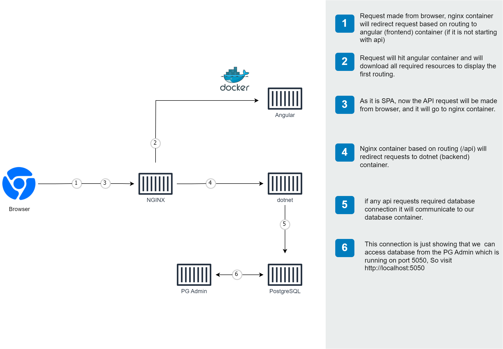

# AWS Lightsail

## Overview
**AWS Lightsail** is an easy-to-use cloud platform that offers developers a straightforward way to build and manage web applications, websites, and more using the power of AWS. It provides simplified cloud infrastructure resources including virtual private servers (instances), containers, storage, and networking at a lower cost and with minimal setup requirements.

## Key Features

### 1. **Virtual Private Servers (Instances)**
   - Lightsail instances are virtual machines that run a variety of operating systems and come pre-configured with development stacks.
   - You can choose from Linux/Unix or Windows operating systems.
   - Offers a range of instance plans based on memory, processing power, and storage needs.

### 2. **Containers**
   - **Lightsail Containers** allow you to deploy, manage, and scale containerized applications in the cloud.
   - Ideal for running Docker containers without needing to manage underlying infrastructure.
   - Containers provide a simplified solution for deploying microservices or packaged applications.
   - You can integrate Lightsail containers with other AWS services for scaling, logging, and monitoring.

   #### Key Benefits of Lightsail Containers:
   - **Simplified Deployment**: Deploy containerized apps quickly and easily with minimal setup.
   - **Auto-scaling**: Automatically scale your containers to handle increases in traffic or workloads.
   - **Load Balancing**: Distribute traffic across multiple containers for high availability.
   - **Networking**: Easily configure public and private networking options for your containers.
   - **Integration**: Use Lightsail’s built-in monitoring, logging, and alerting features to keep track of your container performance.

   #### Common Use Cases:
   - Deploying containerized web applications or microservices.
   - Running stateless applications that require easy scaling.
   - Rapidly testing and deploying new features in isolated environments.

### 3. **Managed Databases**
   - Lightsail provides managed databases such as MySQL, PostgreSQL, and MariaDB.
   - Automated backups and built-in monitoring to ensure database health.

### 4. **Scalable Storage**
   - **Block Storage**: Additional storage volumes that you can attach to Lightsail instances.
   - **Object Storage**: Lightsail also offers scalable, secure, and affordable object storage using S3 for static content, backups, and other data.

### 5. **Networking**
   - **Static IPs**: Assign static IP addresses to your instances for easy DNS management.
   - **DNS Management**: Host your DNS zones using Lightsail DNS, including managing domain names and integrating with Route 53.
   - **Load Balancers**: Automatically distribute traffic across multiple instances for better availability and scalability.

### 6. **Pre-configured Blueprints**
   - Quickly launch instances with pre-configured environments such as WordPress, Node.js, LAMP, Nginx, Django, and more.
   - Ideal for developers looking for fast deployment without manual configuration.

### 7. **Easy-to-Use Console**
   - Lightsail’s user-friendly interface allows for easy management of resources such as instances, databases, and networking.
   - Simple integration with other AWS services like CloudFront, RDS, and S3.

## Use Cases

### 1. **Websites and Web Applications**
   - Host simple websites or full-fledged web applications using pre-configured solutions like WordPress, Joomla, or custom stacks.

### 2. **Development and Testing**
   - Spin up isolated environments to develop and test new features or applications without the complexity of configuring networking or security.

### 3. **Containers**
   - Deploy, manage, and scale Docker containers for microservices or packaged applications.

### 4. **Managed Databases**
   - Deploy and manage relational databases with automatic backups and simplified scaling.

### 5. **Simple Workloads**
   - Ideal for small applications, blogs, e-commerce websites, and non-critical workloads that need affordable and scalable infrastructure.

## Pricing

#### Lightstail Instances Pricing


#### Container Instances Pricing


## Advantages

- **Simplified Setup**: Easy to launch and manage with little cloud infrastructure knowledge.
- **Predictable Pricing**: Fixed pricing structure without unexpected bills.
- **Fast Scaling**: Add more resources, containers, or instances as your application grows.
- **Integrated Networking**: Simplified DNS and load balancing services.
- **Preconfigured Environments**: Pre-built application templates for fast deployment.

## Limitations
- **Limited Customization**: Lightsail is simplified and may not offer as much flexibility as other AWS services like EC2.
- **Scaling Limitations**: Lightsail is better suited for small to medium workloads, and scaling to large applications might require migrating to EC2 or other AWS services.

## Getting Started

1. **Sign in to AWS Lightsail**: Go to the [AWS Lightsail Console](https://lightsail.aws.amazon.com/) and sign in with your AWS account.
2. **Create an Instance or Container**: Choose your instance or container location, operating system, and plan.
3. **Connect to Your Instance/Container**: Access your instance through SSH (Linux/Unix) or RDP (Windows), or manage your container via the Lightsail console.
4. **Deploy Your Application**: Use a pre-configured blueprint or deploy your custom application or container.

## Integrating with Other AWS Services
AWS Lightsail integrates with other AWS services for advanced use cases:
- **Amazon S3** for object storage.
- **Amazon CloudFront** for content delivery and caching.
- **Amazon RDS** for advanced database solutions.
- **Amazon Route 53** for domain registration and DNS routing.

# Application Architecture


# Nginx Reverse Proxy Configuration for Docker Containers

In this guide, we will explore how to configure Nginx as a reverse proxy for Docker containers running two services: `frontend` and `api`. Nginx will forward requests based on the URL path to the appropriate container service.

## Nginx Configuration

Below is the Nginx configuration file (`nginx.conf`) that sets up two upstream services and routes requests between them.

```nginx
events {
    worker_connections 1024;
}

http {
    upstream frontend {
        # This backend refers to the frontend service running in a container
        server frontend:4000;
    }

    upstream api {
        # This backend refers to the API service running in a container
        server api:8000;
    }

    server {
        listen 80;
        server_name frontend api;

        location / {
            resolver 127.0.0.11 valid=30s;
            proxy_pass http://frontend;
            proxy_set_header Host $host;
        }

        location /api {
            resolver 127.0.0.11 valid=30s;
            proxy_pass http://api;
            proxy_set_header Host $host;
        }
    }
}
```

# Deployment Steps
- Set up lightstail instance (better to use Linux, resource allocation depends on workload)
- Install on lightstail instance git,github,docker and docker compose
- Login to your github account from lightstail instance
- Clone repository
- Run containers
- Be sure appropriate port of machine is opened. 80 for http is opened by default and 22 for SSH

### Important questions

How to access database securly?

How to execute migrations from local machine?

# SSH Protocol and SSH Tunneling

## SSH Protocol

**SSH (Secure Shell)** is a cryptographic network protocol used for secure communication over an insecure network, such as the internet. It provides a secure channel over an untrusted network by using encryption to protect the data being transferred. SSH is commonly used for remote administration of systems, secure file transfers, and secure network services.

### Key Features

- **Encryption**: SSH encrypts the data being transmitted, ensuring that eavesdroppers cannot read the contents of the communication.
- **Authentication**: SSH uses various methods to authenticate users, such as passwords, public key authentication, and more.
- **Integrity**: SSH ensures that the data has not been tampered with during transmission.
- **Forward Secrecy**: It provides forward secrecy, meaning that even if an encryption key is compromised, past communications remain secure.

### Common Use Cases

- **Remote Command Execution**: Securely executing commands on a remote server.
- **Secure Shell Access**: Accessing remote systems via a command-line interface.
- **File Transfers**: Using tools like `scp` (secure copy) and `sftp` (secure file transfer protocol) for secure file transfers.

## SSH Tunneling

**SSH Tunneling** (or port forwarding) is a technique that allows you to forward network ports from one machine to another through an SSH connection. This can be useful for securely accessing services that are not directly exposed to the internet or for bypassing firewalls and other network restrictions.

### Types of SSH Tunneling

1. **Local Port Forwarding**:
   - Redirects a port on your local machine to a port on a remote server through an SSH connection.
   - Example: You can forward local port 8080 to port 80 on a remote server, allowing you to access a web application running on the remote server as if it were running locally.

   ```bash
   ssh -L local_port:remote_host:remote_port user@ssh_server
   ```


# Cloudflare and Domains

## Overview

Cloudflare is a popular web infrastructure and website security company offering a range of services. This includes content delivery network (CDN), DDoS protection, and domain management. Here’s an overview of how Cloudflare interacts with domains:

## Domain Registration

Cloudflare provides domain registration services, allowing you to:
- Register new domains or transfer existing ones to Cloudflare.
- Simplify domain configuration with automatic DNS management.

## DNS Management

Cloudflare’s DNS management includes:
- **Global Anycast Network:** Ensures DNS queries are answered from the nearest server, improving speed and reliability.
- **DNS Security:** Protects against DNS attacks and provides DNSSEC support for enhanced security.
- **DNS Analytics:** Offers insights into your DNS traffic.

## Content Delivery Network (CDN)

Cloudflare’s CDN features:
- **Caching:** Reduces latency and improves load times by caching content at various locations around the world.
- **Speed:** Enhances the delivery of static content such as images, scripts, and stylesheets.

## DDoS Protection

Cloudflare provides robust protection against Distributed Denial of Service (DDoS) attacks with:
- **Mitigation:** Absorbs and mitigates large-scale attacks to ensure website availability.
- **Security Measures:** Protects your site from high traffic volumes caused by attacks.

## SSL/TLS Encryption

Cloudflare offers SSL/TLS certificates to:
- **Encrypt Traffic:** Protect sensitive data and improve security.
- **Automatic Renewals:** Manage certificates easily with free options.

## Performance Optimization

Cloudflare provides various performance optimization features, including:
- **Image Optimization:** Enhances image loading speeds.
- **Mobile Optimization:** Improves performance on mobile devices.
- **Resource Minification:** Minifies CSS and JavaScript to reduce load times.

## Firewall and Security Features

Cloudflare’s security features include:
- **Web Application Firewall (WAF):** Protects against common web threats and vulnerabilities.
- **Rate Limiting and IP Blocking:** Manages traffic and enhances security.
- **Bot Management:** Controls bot traffic to safeguard your site.

## Analytics

Cloudflare offers analytics for:
- **Traffic Metrics:** Understand your traffic patterns.
- **Security Metrics:** Monitor security threats.
- **Performance Metrics:** Optimize performance based on detailed insights.

Using Cloudflare for domain management and security can significantly enhance your website’s performance and protection. For more information or specific use cases, feel free to explore Cloudflare’s documentation or contact their support.


## Resources

- [AWS Lightsail Documentation](https://docs.aws.amazon.com/lightsail/)
- [Getting Started with Lightsail](https://lightsail.aws.amazon.com/ls/docs/getting-started/)
- [Lightsail Pricing](https://aws.amazon.com/lightsail/pricing/)
- [Source code](https://github.com/djordjekrsmanovic/angular-dotnet-core-docker)
